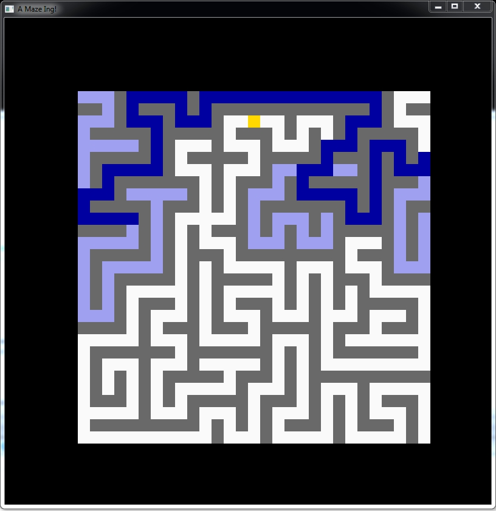

a-maze-ing
============
A mouse is looking for a piece of cheese.

[](./LICENSE)



## Usage

Run with an example file:

`a-maze-ing misc/example-input/mazes.txt`

## Dependencies

Graphics library: [SFML](https://github.com/SFML/SFML) >= 3.0

## Build with CMake

For example on Windows:

```
$ mkdir build
$ cd build
$ cmake -G "Visual Studio 17 2022" -DBUILD_SHARED_LIBS=FALSE ..
$ cmake --build . --config Debug
```

## Install

Install in some dir:

```
cmake --install . --config Release --prefix <some_dir>
```

Or, package the library:

```
cpack -G ZIP -C Release
```
