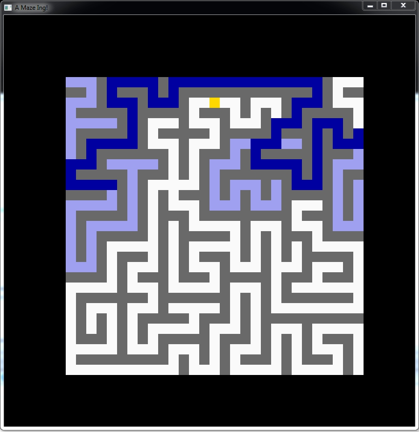

a-maze-ing
============
A mouse is looking for a piece of cheese

Snapshot:



## Prerequisites

Graphics library: [SFML](https://github.com/SFML/SFML) >= 2.5. Download the binaries specific to your build environment: [SFML Download](https://www.sfml-dev.org/download.php)

## Build

Build using CMake: https://cmake.org/download/

For example on Windows:

```
$ mkdir build
$ cd build
$ cmake -G "Visual Studio 14 2015 Win64" -DSFML_DIR="C:/SFML-2.5.1/lib/cmake/SFML" ..
$ cmake --build . --config Release
```

## Misc

A [Code::Blocks](http://www.codeblocks.org/) project file is provided

## License

[](./LICENSE)

